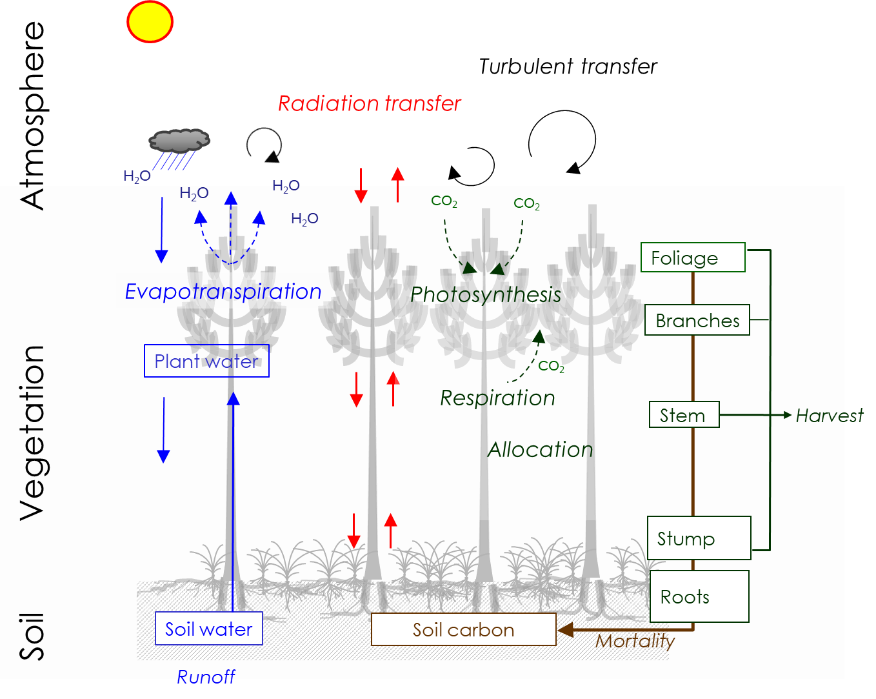
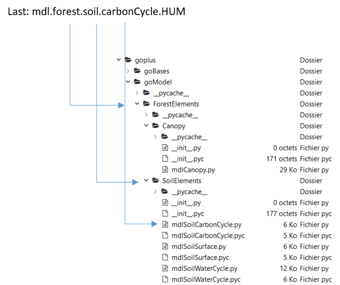
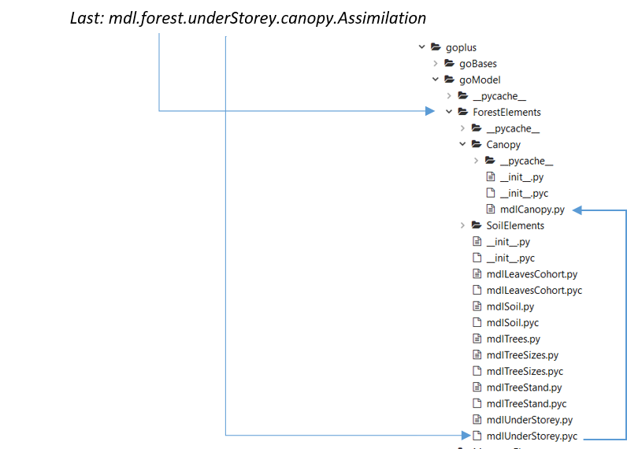

[]{#_Toc33831285 .anchor}User manual

GO+ version 3.0

2020-02-10.

{width="3.960382764654418in"
height="3.1584634733158357in"}

Denis Loustau, Christophe Moisy, Alexandre Bosc, Soisick Figuères, Simon
Martel, Virginie Moreaux, Delphine Picart-Deshors,

INRAE, UMR ISPA, Villenave d’Ornon, 33140, France.

Contact. Denis.Loustau@inrae.fr

Introduction
------------

The Python 3.0 code documented in this manual is the GO+ v3.0 model. The
first version of the model was developed during Annabel Porté’s Ph D
Thesis (1999) and within the *Carbofor* project (2001-2003, French
Ministers of Ecology and Agriculture, Loustau et al. 2005, 2010). A
second version including management and incorporating the soil carbon
Roth-C model was developed by Virginie Moreaux during her PhD thesis
research (2011) and further enhanced by David Achat, Delphine
Picart-Deshors and Simon Martel. Among others addition and complements,
a nutrient module was added. GO+ versions were adapted to broadleaved
species and Douglas fir (Achat et al. 2018within the framework of
projects supported by the French national agency of research (ANR
projects ORACLE and MACCAC of the programs CEPS and *AgroBiosphère*
respectively), CNRS (project Forever), ADEME (project *Evafora*), and
Agriculture and Forest French Minister (Roux et al. 2018).

The version 3.0 merges these “branch” species-specific versions into a
single “trunk” code where all species and management options are
implemented. The GO+ model is still being developed within projects
supported by ADEME (project *BIOSYLVE*, program *GRAINE*) and the French
Ministry of Agriculture and Alimentation (project *Forêts-21*, program
*Investissement pour l’amont forestier*). This code is therefore
expected to be maintained until 2024.
This manual is documenting the version3.0 as delivered in the associated
package. This version of GO+ code is not degraded and includes calculations
performed at the tree level: living fraction of biomass parts, respiration,
growth. Simplified versions may be used when upscaling GO+ at large scale.  

General organisation of the GO+ model code (Python 3.2).
------------------------------------------------------

All the model elements are located under the *goplus* folder. Other
folders contained the parameters files of species (\\*Parameters
files\\Species*) and site ( *Parameters files\\Site)*, meteorological
data sets (\\*Met files*), or initial values of the individual tree
diameter (\\*Parameters files\\Tree stand)*. Some examples of output
files are provided in the \\*output files* folder. The \\*Scripts*
folder includes examples of the scripts that are short python codes
launching a simulation.

Three folders are located under \\*goplus*:

-   *\\goBases*

-   *\\goTools*

-   *\\goModel*

where *\\goBases* and *\\goTools* are including mathematical functions,
integration functions and definitions of elements that are used in the
main model. The third, \\*goModel*, is organising the different
component describing the biological and physical processes included in
GO+.

The GO+ model is launched using short script files*.* Some example
script files are provided in the *Scripts* folder. These examples can be
used for simulating the data shown in Moreaux et al 2020 GMD manuscript
table 2 or figures 13 and 14 respectively.

The script file instantiates the model. It defines the list of output
variables (section 5) and specifies the path of the parameters, site,
initialisation and meteorological files required by the model. The files
needed are comma separated csv files including forcing variables and
parameters as follows:

-   meteorological data set (ex. *Met\_FR-LBr\_1984-2011.csv*)

-   species-specific parameters data set (*Ppinaster.csv*,
    *Fsylvativa.csv*, *DouglasFir*.csv etc.)

-   a site-specific data set *DK-Sor.csv, DE-Sol.csv etc.*

-   a file including list of tree stem diameter(cm) used for initiating
    the tree stand *,* such as *FR‑Hes\_dbh\_1998* and
    *FR‑LBr\_dbh\_1987.csv. *

Installation
-------------

-   GO+ runs with python3 and numpy library

-   Linux :

    -   install *python3* and *python3-numpy* packages

    -   from a terminal, run : *python3 Validation\_Ppinaster\_Bray.py*

-   Windows :

    -   install Anaconda distribution
        ([*https://www.anaconda.com/distribution/\#download-section*](https://www.anaconda.com/distribution/#download-section))

    -   from windows Start menu, select Anaconda3 and Anaconda Prompt

    -   navigate to GO+ Applications directory : cd goplus/Scripts

    -   enter the path of the python executable and of the goplus
        application to run, e.g. *c:\\ProgramData\\Anaconda3\\python.exe
        Validation\_Ppinaster\_Bray.py*

To run GO+, you need to extract the source code, keeping its tree
directory. Navigate to *Scripts* directory and run one of the program,
for example :

*python3 Checking\_Ppinaster.py*

Once the program is started, you will start to see the outputs of the
model :

*1998 Age: 75.0 , nb: 328 , HEIGHT: 29.880109057009467 , DBH:
24.91856707317075 IStress: 0.0 LAI 3.0803941144628815*

Other examples are as follows. All files but the scripts are in csv
format.

  Script (.py)                   Site parameters   Species       Meteorological data   Initial Tree Stand DBH   Output file
  ----------------------------- ----------------- ------------ ----------------------- ------------------------ --------------------------
  Fs\_DK-Sor\_1998-2012         DK-Sor            Fsylvatica      Met\_DK-Sor\_1998-2013    DK-Sor\_dbh\_1998        DK-Sor\_1998-2012\_d
  Pp\_FR-LBr\_1987-2010         FR-LBr            Ppinaster       Met\_FR-LBr\_1984-2011    FR-LBr\_dbh\_1986        FR-LBr\_1987-2011\_d
  Fs\_FR-Hes\_1998-2010         FR-Hes            Fsylvatica      Met\_FR-Hes\_1998-2010    FR-Hes\_dbh\_1998        FR-Hes\_1998-2010\_d
  DF\_BC49\_1998-2010	          BC-DF49           Douglas Fir     Met\_BC-DF49\_1998-2010   generated                BC\_DF49\_1998-2010\_d 

GO+ model elements.
--------------------

### Clock and climate elements

#### LocTime (*mdlLocTime.py*).

It provides a clock, *locTime,* and some temporal milestones (start and
end of the day and year) allowing to trigger, start or terminate
specific model processes.

#### Climate (*mdlClimate.py*)

This element reads the meteorological data file, calculates the
atmospheric pressure at ground level, diffuse – direct fractions of the
incident shortwave radiation and atmospheric CO~2~ concentration. The
CO~2~ concentration can be prescribed according to the following
scenarios.

-   historical data based on the *Mauna Loa* observatory time series
    since 1950 (scenario 0).

-   RCP 2.6, 4.5, 6.0 and 8.5 scenarios (Moss et al. 2010) as proposed
    by the *ISIMIP* platform (scenario 3, 4, 6 and 8 respectively).

-   *SRES A2* scenario (scenario 2)

-   Constant and fixed at 500 ppm (scenario 1), this value can be
    changed.

    i.  #### MicroClimate (*mdlMicroClimate.py*)

It calculates :

-   Air specific humidity, air vapour saturation partial pressure and
    saturation deficit at reference level from the data obtained from
    the meteorological data set.

-   Temperature dependent air properties: dry air density, specific heat
    of air, psychrometric constant.

    i.  #### SunLocal (*mdlSunLocal.py*)

From the site latitude and altitude, the *SunLocal* module provides the
sun azimuth and elevation at any time of year. In the version 3.0 as
provided, the effects of slope and exposure of the site are not
activated.

### Forest element (*ForestElements\\mdlForest.py*)

*Forest* is an integrative element grouping the two vegetation layers,
soil layer, and microclimates associated with each layer. Forest
executes two tasks:

-   it calls the processes solved, starting from the top (tree layer) to
    the bottom (soil layer) and manages exchanges of variables or values
    between components, such as passing micrometeorological variables
    values among canopy layers.

-   from the elementary processes implemented in each vegetation and
    soil layer, *Forest* calculates the values of main variables
    integrated over the entire ecosystem.

> *Rnet = var('net radiation calculate as the ecosystem radiative
> balance (W m-2\_soil)')*
>
> *H = var('sensible heat flux (W m-2\_soil)')*
>
> *LE = var('latent heat flux (W m-2\_soil)')*
>
> *ETR = var('actual Evapotranspiration (kg\_H2O m-2\_soil hr-1)')*
>
> *T = var('Global Transpiration (kg\_H2O m-2\_soil hr-1)') *
>
> *NEE = var('Carbon-CO~2~ Net Ecosystem Exchange (g\_C m-2\_soil
> hr-1)') *
>
> *NPP = var('Ecosystem Net Primary Production (gC m-2\_soil hr-1)') *
>
> *GPP = var('Ecosystem Gross Primary Production (gC m-2\_soil hr-1)') *
>
> *Reco = var('ecosystem respiration (gC m-2\_soil hr-1)') *
>
> *RAuto = var('Autotrophic ecosystem respiration (gC m-2\_soil hr-1)')*
>
> *RUNOFF = var('Runoff (kg\_H2O m-2\_soil hr-1)') *
>
> *SoilCarbon = var('Soil organic carbon = sum of DPM, RPM, HUM and BIO
> (gC m-2\_soil)')*
>
> *BiomCarbon = var('Biomass Carbon stock (trees + understorey (gC
> m-2\_soil)')*

### TreeStand element (*mdlTreeStand.py*).

This class includes the main canopy processes: phenology, carbon
allocation, growth, respiration, hydraulics, senescence. These proesses
are solved for the entire canopy and tree stand apart from the respiration
that is calculated for each individual tree. The parameters needed in
each section are provided in corresponding subsections of the species
parameter file:

-   Phenology, growth structure (5)

-   Tree hydraulics (6)

-   Respiration of the tree parts (7)

-   Carbon Allocation among tree parts (8)

*TreeStand* simulates also the tree mortality and manages the tree stand
installation. Finally, it calculates the statistics related to tree
height, diameter, basal area and biomass. *TreeStand* calls three
daughter classes: canopy processes, cohort lifecycle and tree growth.

#### Canopy processes (*Canopy\\mdlCanopy.py*)

The *Canopy* class is called by the *TreeStand* and *Understorey*
classes using layer specific set of parameters listed in the
*ParamSpecies.csv* file. It describes the exchanges of energy and mass
between the tree canopy as a whole, and the atmosphere. The group of
parameters associated are as follows ( + section number of the species
parameter file):

-   Stomatal model (1)

-   Radiation transfer and energy balance (2)

-   Rainfall interception (3)

-   Photosynthesis (4)

#### Leaf Cohort (*mdlLeavesCohorts.py* parameters file section 5)

This class describes at a daily resolution the life cycle of leaf –or
needle- cohort(s) of the tree layer as a whole. It includes their
phenological stages from budburst to leaf expansion and shedding.
Depending on the species, the number of cohort may vary from one
(broadleaved species) up to four and more (coniferous and evergreen
species). The module uses the name of the species declared in the
species parameter file (heading lines) and the value of the current year
cohort biomass calculated from the allocation of the primary production
among tree parts (4). This module is not used by the calculation of
understorey leaf area or biomass (see section 4. *Understorey* below).
Associated parameters values are documented in the section (5) of the
*ParamSpecies.csv* file

#### Tree growth (parameters file section 8)

In this element, the individual tree growth is calculated annually using
species-specific allometry equations. The tree layer annual assimilation
is allocated to individual trees based on their individual leaf weight.
The individual net increment in biomass named *Wproducted* (kg dm) is
then derived after substracting the maintenance and growth respiration
from photosynthesis. *Wproducted* is first partitioned among below- and
aboveground parts and then among tree organs. When the annual carbon
balance of a given tree is negative, one tree among two is assumed dead
and removed from the tree population.

### Understorey element.

Just like *TreeStand*, *Understorey* organises as series of internal and
external processes describing phenology, radiation transfer, energy
balance, transpiration, rainfall interception, photosynthesis mortality,
respiration, and finally growth of the understorey vegetation. The
understorey model has the following specificities:

-   unlike the tree layer, the understorey vegetation is generic and
    does not identify specific species or individual plants.

-   the understorey vegetation includes three parts, the foliage, roots
    and perennial part (can be either stem, seeds, rhizome).

-   the growth of each plant part is resolved at a daily resolution
    whereas, apart from the foliage, tree growth is calculated only once
    a year.

The processes implemented in the *Canopy* module for the understorey are
identical than for trees. They are included in the *Canopy* class that
is called by *Understorey*. The group of parameters associated are as
follows (section number of the species parameter file):

-   Stomatal model (9)

-   Radiation transfer and energy balance (10)

-   Plant hydraulics (11)

-   Rainfall interception (12)

-   Photosynthesis (13)

The phenology, respiration, plant hydraulics, growth and mortality are
internal functions of *Understorey*, defined and coded within.

### Soil element (in *\\SoilElements)

#### Surface processes (*mdlSoilSurface.py*)

The soil surface-atmosphere exchanges of energy and water are calculated
hourly. The soil surface water balance is described first separating the
dry and wet fractions of soil surface and then calculating the
evaporation from each. The dry surface resistance is empirical and
assumes the resistance increases linearly with soil moisture deficit.

#### WaterCycle (*mdlSoilWaterCycle.py*)

The soil water retention characteristics are the water content at
saturation, field capacity, wilting point and residual. They are either
prescribed as such or calculated dynamically using pedotransfer
functions, the soil texture and organic matter content
(*pcs\_Hydro\_parameters*). The Van Genuchten parameters can be also
prescribed as such or calculated from the soil texture, basic density
and organic matter content (*pcs\_VG-parameters*). The parameters
needed, such as the soil texture, basic density and initial value of
soil water and carbon are provided in the *Site.csv* file.

*WaterCycle* calculates the water balance of the soil. The soil is
modelled as three component bucket cascading system. It includes three
dynamic layers : dry surface layer, *A*, has a water content below field
capacity, unsaturated layer, *B,* has a water content between field
capacity and saturation and the deeper layer, *C*, is saturated
(flooded).

From the values of the water content and depth of layers *A, B* and *C*,
the groundwater discharge and the root zone mean water content are
calculated (*pcs\_discharge, pcs\_layersDepthUpdate,
pcs\_WaterStatusInRootsLayer*) and the water potential and hydraulic
resistance of the soil matrix in the root zone are modelled using Van
Genuchten equations.

#### Soil CarbonCycle (*mdlSoilCarbonCycle.py*)

This is a *Python* adaptation of the *Roth-C* model running at a daily
time step. Organic matter input into the soil is provided by litterfall
and mortality of canopy layers and roots. The requested parameters of
the soil are provided in the *Site.csv* file and those related to the
vegetation, *e.g.* the DPM/RPM ratio and age of plant parts, in the
*species.csv* file section 17.

The only change of the Roth-C model in GO+ is the introduction of a
“plowing” effect. It is modeled by multiplying the decomposition and
mineralisation of the soil carbon fraction affected by a factor whose
value is prescribed in the *Site.csv* file. This effect has a halftime
duration also specified in the *Site* file.

### Manager elements (*goplus\\goModel\\ManagerElements*)

#### Management operations

The module *mdlMngt\_Operations* is a catalogue describing each of the forest
operations commonly performed in European forestry, from the plantation
or natural regeneration to pre-commercial thinnings, understorey
control, coppicing, clearcutting and logging.

Thinnings. Thinning operations are removing trees from the stand using
tree selection based upon tree individual diameter. In coniferous
stands, the selection can be set from the top (thicker trees), from the
bottom (thinner trees) or random, using a value of the power of the
diameter rank normalised in \[0, 1\], named *Thin\_Factor*. A power below
 1.0 select thicker trees, and conversely thinner trees when &gt;1.0.
Trees are drawn randomly until the thinning target value (basal area,
competition index or number of trees) is reached.

Example 1. Script used to test the mmodel against historical observations.
The historical management of the Beech stand at the FR-Hes site includes
a plantation in 1966 and successive natural or artificial thinnings in 1998,
1999, 2000, 2001, 2004, and 2009. For each of them the number of trees
removed, their size rank and the part of tree harvested is
specified inthe first part of the script named *Fc\_FR-Hes\_1998-2010.py* as
explained below.

L5 - L72 list the variables to be output.
L90 - 97 creates a dictionary listing the management events and set up their parameters.
L105 - L123 initialise the values of management  variables.
L128 – L145 specify the management operations to be implemented, here a plantation in 1966
and  thinnings based on the stem density criteria.

{width="6.3in" height="5.160416666666666in"}

The ‘PLANTATION’ includesa  soil preparation affecting 20% of
area and 20% of the soil carbon (L132) and the plantation of 5000
2-year old seedlings. The code of the stand regeneration itself is
listed in the *mdlMngt_Operations* module as the
*do\_New\_Trees* function that includes four parameters,
age of trees, stem density per hectare and the mean and standard
deviation of the tree DBH . From those, it created a tree stand having
a Gaussian  distribution of DBH with a mean of 3 cm and
standard deviation of 1 cm prescribed at L91.

The *‘*THINNING*’* includes two distinct operations, the selection
of trees to be cut as *do\_Density\_Thinning* (L136) and stem logging
instantiated in the *do\_Logging* function (L140). Until the density
objective is reached, the successive thinnings remove either larger trees in
1998 (*ThinFactor* = 0.8) or randomly selected individuals (*ThinFactor*
= 1). For each thinning only the stem is harvested and the other tree parts
are leftover. Additional thinning operations based on competition
(*do\_RDI\_thinning*) or basal area criteria  (*do\_BA\_Thinning) are
 also available as functions of the *mdlMngt\_Operations* class.

Logging

The *do\_Logging* object put the left over parts of the trees cut into
the soil and update the tree stand. It calculates the main statistics of
the trees harvested, affects a number to the thinning and updates the
rotation year.
CAUTION: the do_Logging function must be called following each thinning or
clearcutting operation.
The part of the tree harvested can be only the stemwood or
comprises also the branches, taproot or foliage biomass. The understorey
is not harvested. The biomass leftover is input into the soil organic
matter. Any thinning of clearcutting can be combined with soil
operation.

Clearcutting

The do_Clearcut is actually similar to a thinning operation for which
all trees would be removed buthas been coded as a separate function.  

Soil and understorey operation

The soil can be plowed, stripped,moulded of disked. These operations are
all defined by the generic “*do\_Plow*” operation. The user must specify :

-   the fraction of the soil organic carbon affected, as a percentage
    (gC gC-1),

-   the fraction of area concerned (m2 m-2).

*Do\_PLow* is managing the effect of the soil carbon cycle and the
understorey, incorporating plant parts killed into the soil. In this
version, the operation is not supposed to mix the soil organic matter of
the root layer with deeper soil. The root and soil depths are not
supposed to be changed either. The understorey vegetation is removed by
the soil operation in proportion of the area fraction for the
aboveground biomass and the fraction of soil organic carbon times the
area fraction for the underground parts.

Example 2. A soil tillage of the entire area until a depth of 0.5m
--where all the organic carbon is included-- should be specified as:

>*self.do\_Plow(areaFractionPlowed = 1.0 ,soilCarbonFractionAffected
>=1.0)*

In this case, the understorey foliage, roots and perennial parts are
entirely destroyed and put into the soil.

Example 3. A light soil surface disking made between tree rows in a pine
plantation as fire preventing measure and affecting 75 pct of the plot
area and the top 10cm --where 15 pct of the soil organic carbon is
present-- will be defined as:

> *self.do\_Plow(areaFractionPlowed = 0.75 , soilCarbonFractionAffected
> =0.15)*

The understorey foliage will reduced by 75pct and the belowground part
(roots and perennial) by 0.75 x 0.15=0.1125 pct.

Example 4. The removal of all understorey aboveground parts is
prescribed by:

> *self.do\_Plow(areaFractionPlowed = 1.0 , soilCarbonFractionAffected
> =0.0)*

#### How can a management plan be coded in GO+ ?
The management of the forest stand itself is a combination of forest
operations and rules triggering each specific operation. The operations
detailed previously and coded  in the *mdlMngt\_operations* are the basic
generic forest operations in monospecific enev aged forest stands than
can be combined in multiple ways in a management plan starting from
an initial state and going through an entire forest life cycle. This
manual and the V3.0 code version provides one example below and will
be updated with additional operations and management plans.

Example 5. (script *Fs\_FR-MTR\_2006-2100_managed* and *\_unmanaged*). In
 a recent Master’s research (Figuères, 2019), the model was applied to simulate
 old-growth beech forest close from the Pyrenean mounts. Specifically a standard
 management plan was compared to an unmanaged forest reservation plan
with no management. We provide the scripts and the files requested to
 run a 140 year-old beech stand from 2006 to 2100 according to the two
 management alternatives. The management plans are both included in the
 Manager module.

-   The management plan (*manager.practicesType* = 0 ) is the standard management
    performed bythe French national forest Office. It includes successive thinnings
    allowing to harvest timber in the young phase and to thin subsequently the tree stand
    in order to regenerate a new stand. The plan goes through a clearcut and regeneration.
    The thinnings are all based on target values of the basal area and dominant height.
-   The self thinning rule based upon the Relative Density Index (RDI) is applied
    to the forest reserve (*manager.practicesType* = 2).  It is based upon the
    Reineke (1933)  competition index, RDI, adapted by Le Moguedec and Dhôte (2002).
    When RDI exceeds 0.95, mortality is triggered until RDI comes back below the value
    0.85. In this particular case, RDI threshold is not reached, tree mortality is
    being provoked instead by a negative carbon balance.  

Files required
--------------

The files are self-explanatory since including a description and unit of
all variables together with default values.

-   **Site.** Ex: *\\Parameters\\Site\\FR-LBr.csv.* This file includes 31
    parameters that are describing the leap year accounting method,
    altitude, latitude, slope, exposure, reference level of the
    meteorological data, area of the plot, initial age of trees and
    soil texture and depth.
    The following rules must be observed when completing this file:

    -   sum of the percentages of texture classes must be 100;

    -   initial depth of layer B should be equal or lesser than the root
        depth;

    -   The area must be the area of the plot where the tree stand
        inventoried in the *treedbh.csv* file is present. It can be
        anything from 10 to 10^6^ m² (the computation time is however
        depending upon the number of trees and the plot area).

    -   The reference level corresponding to the meteorological
        variables data set must be either 2 or 10m.

-   **Meteorological.** The meteorological file must include a complete
    time series of hourly values of meteorological variables, air
    temperature, horizontal wind speed, air water vapour pressure, bulk
    precipitations, diffuse and direct incident shortwave radiations and
    incident longwave radiation. The values must correspond to either
    z=2m or z=10m above ground. When leap years are present, the first
    parameter of the site file must be set to 1, zero otherwise.

-   **Species specific parameters.** This file includes 242 parameters
    together with their description and defaults values. It is organised
    by layers (trees, understorey and soil) and among 17 sections
    related to specific processes. The parameters description matches
    the table S1 of the supplementary material of the Moreaux et al
    manuscript. Two species are documented so far, European beech and
    Maritime pine and other species (*Douglas Fir, eucalyptus Gunnii,
    Pinus sylvestris, Quercus robur)* will be added soon.

-   **Tree stand inventory.** The file includes a list of the diameter
    at 1.30 m height of the individual trees present in the plot at time
    t=0 (cm). it is used for running the model from a given initial
    stand. Alternatively, GO+ can also be run from a stand created using
    a prescribed distribution (number of trees per hectare, mean and
    standard deviation of the DBH) assumed normal.

Output files
------------

-   **Output variables declaration.** The Python GO+ code provides a
    range of options for selecting output variables and statistics
    associated. The output files are typically a continuous time series
    of values of the statistics of variables selected by the user.

    -   The time step at which GO+ resolves its variables can be either
        hour, day or year and is declared in the script file. Only one
        time resolution can be chosen in each run.

    -   Any number of variables can be obtained (but be parsimonious
        because the writing process slows down the execution of the
        program). The list of the main variables provided at the
        ecosystem level is provided in section 7.

    -   Optionally, some code lines put as comments in the
        *forest.treeStand* class allow for creating a file containing
        the standing –or dead- tree inventory. Similarly, some optional
        code lines are actionable in the *LeafCohorts* class, allowing
        to create a file containing the leaf cohort characteristics in
        order to check their phenology and life cycle.

-   **Statistics.** The following statistics can be calculated over the
    time span chosen: min, max, last, mean, sum.

At the hourly time step, these statistics produce of course the same
value. The list of variables available together with their stats must be
declared in a string “*varsToIntegrate*” heading the script file.
Alternatively, they can also be listed in a file and called by the
script. For instance, to obtain a csv file including year, day of year,
sum of Rain, shortwave direct and diffuse radiation, ecosystem GPP and
ETR the following lines must be inserted:

> *varsToIntegrate =’’’*
>
> *Last: mdl.locTime.Y*
>
> *Last: mdl.locTime.DOY*
>
> *Sum: mdl.climate.microclim.Rain*
>
> *Sum: mdl.climate.microclim.SWDir*
>
> *Sum: mdl.climate.microclim.SWDif*
>
> *Sim: mdl.forest.LE (or mdl.forest.ETR)*
>
> *Sum: mdl.forest.GPP*
>
> *‘’’*

-   **Variable names**

The data values simulated and requested are output in a csv.file headed
by the variables names coded at the end of the script file. The names
are composed according to the following:

*SSSS:mdl.folder.(subfolder).class.(subclass).XXXX*

where:

-   *SSSS* is the stat requested (Last, Mean, Sum, Min or Max)

-   “*Folder*” may be “*forest*” or “*manager*” that stand for
    *ForestELements* and *ManagerElements* respectively. This item is
    not needed for the clock and climate variables since the related
    objects, *locTIme, SunLocal, Climate* and *Microclimate* are
    directly under the main folder.

-   “*Subfolder*” is the below level folder when present.

-   “*Class*” is the main class where the variables are instantiated.

-   “*Subclass*” names a class called by the Class above.

-   *XXXX* is the variable name.

The main variable names in the code are listed in the *GO+ 3.0 variable
name.pdf* file together with the corresponding symbols, unis and
definitions. The symbols refer to the Moreaux et al. manuscript
submitted at *GeoScientific Model Development*. The diagram below
provides the branching structure of GO+ *Python* files. For obtaining
the stock of carbon if the humified compartment, the corresponding
variable is:

{width="3.8125in" height="3.188330052493438in"}

A second example is for obtaining a time series of hourly values of the
understorey carbon assimilation in gC m^-2^ hour^-1^. Since the “Canopy”
object is called first by the understorey class, the variable name
should read:

{width="4.625878171478565in" height="3.3125in"}

List and mapping of the variables calculated by the GO+ v3.0 code
-----------------------------------------------------------------

The list provided in a separate file, *GO+ v3 variables list.pdf.* It
includes the main variables simulated by the GO+ code. In this list, the
variable name and unit shown is for a hourly resolution and is only for
the tree layer. Obtaining the corresponding variables for the
understorey layer would need to substitute *treesStand* by
*UnderStorey*.

The stats and prefix “mdl” are omitted. Some variables are have not been
explicitly described in the Moreaux et al. 2020 manuscript but are
mentioned in *GO+ v3 variables list..pdf*, and can be obtained when
needed.

References
----------

Achat, D. L., Martel, S., Picart, D., Moisy, C., Augusto, L., Bakker, M.
R., and Loustau, D. 2018. Modelling the nutrient cost of biomass harvesting
under different silvicultural and climate scenarios in production
forests, For Ecol Manag, 429, 642-653, 2018.

Figuères S., 2019.Assessment of the carbon storage potential in old-growth
Pyrenean forests. Masters Degree Diss., ENSAT Toulouse 2019, INRAE, UMR ISPA.
 Spécialisation Qualité de l’Environnement et Gestion des Ressources, 84p.

Le Moguédec, Dhôte, 2012. Fagacées: a treecentered growth and yield model
for sessile oak (Quercus petraea L.) and common beech (Fagus sylvatica L.).
 Ann. For. Sci. 69, 257–269.

Loustau, D., Bosc, A., Colin, A., Ogee, J., Davi, H., Francois, C.,
Dufrene, E., Deque, M., Cloppet, E., Arrouays, D., Le Bas, C., Saby, N.,
Pignard, G., Hamza, N., Granier, A., Breda, N., Ciais, P., Viovy, N.,
and Delage, F., 2005. Modeling climate change effects on the potential
production of French plains forests at the sub-regional level, Tree
Physiol, 25, 813-823, 2005.

Loustau, D. Forests, carbon cycle and climate change. QUAE Eds., Versailles,
2010.

Moreaux, V., 2012. Observation et modélisation des échanges d'énergie et de
masse de jeunes peuplements forestiers du Sud-Ouest de la France., Ph.
D.thesis., Ecole Doctorale 304 "Sciences et Environnements", Thématique
"Physique de l'Environnement", Université de Bordeaux-1, Bordeaux, 262
pages pp., 2012.

Moss, R.H., Edmonds, J.A., Hibbard, K.A., Manning, M.R., Rose, S.K.,
van Vuuren, D.P. et al. .The next generation of scenarios for climate
change research and assessment. *Nature*, 463 (7282), 747-756.2010.

Porté, A., 1999. Modélisation des effets du bilan hydrique sur la production
primaire et la croissance d'un couvert de Pin maritime (Pinus pinaster
Ait.) en lande humide., 1999. Ph. D. (Thèse de Doctorat), Paris XI, Orsay, 160
pp., 1999.

Reineke, L.H., 1933. Perfecting a stand density index for even-agedstands.
 J. Agric. Res. 46, 627±638.

Roux A., Dhôte J.-F. (Coordinateurs), Achat D., Bastick C., Colin A.,
Bailly A., Bastien J.-C., Berthelot A., Bréda N., Caurla S., Carnus
J.-M., Gardiner B., Jactel H., Leban J.-M., Lobianco, A., Loustau D.,
Meredieu C., Marçais B., Martel S., Moisy C., Pâques L., Picart-Deshors
D., Rigolot E., Saint-André L., Schmitt B. (2017). Quel rôle pour les
forêts et la filière forêt-bois françaises dans l’atténuation du
changement climatique? Une étude des freins et leviers forestiers à
l’horizon 2050. Rapport d’étude pour le Ministère de l’agriculture et de
l’alimentation, INRA et IGN, 101 p. + 230 p. (annexes).
